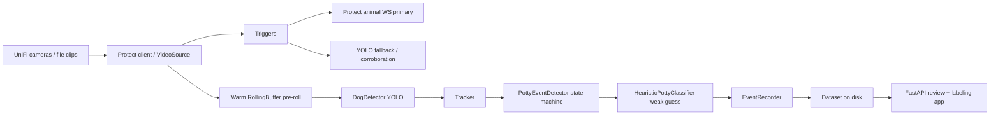

# DetectivePotty

DetectivePotty is a prototype for real-time dog potty detection on UniFi Protect cameras / UNVR Pro. It records candidate potty events, saves clips and high-resolution dog-centered crops, and provides a local review app so a human can label each event as `pee`, `poop`, `not_potty`, or `unknown`.

The v0 pee-vs-poop result is a **weak guess, not ground truth**. Every recorded event is saved as `label_status=unlabeled` until reviewed in the web app. The goal is to build a clean training set for a future custom classifier.

## Architecture

DetectivePotty keeps camera streams warm, uses triggers to mark interesting time windows, detects and tracks dogs, then records reviewable events. The key strategy is **detect small, crop big**: YOLO runs on downscaled frames for speed, but bounding boxes are mapped back to original-resolution frames before saving full frames and dog crops for training.

Latency is handled with a warm `RollingBuffer` pre-roll. A late Protect or YOLO trigger reaches backward into already-decoded frames, and Protect recording download is available as a best-effort high-quality source for the same window.



Main flow: cameras/Protect (or a local file) feed `VideoSource`; a warm buffer preserves pre-roll; `DogDetector` finds dogs; `Tracker` builds tracks; `PottyEventDetector` emits generic potty candidates from stationary+squat posture; `HeuristicPottyClassifier` pre-fills a weak guess; `EventRecorder` writes clips, frames, crops, and metadata; the FastAPI app reads the dataset for review and labeling.

For more detail, see [docs/ARCHITECTURE.md](docs/ARCHITECTURE.md).

## Requirements

- macOS / Apple Silicon is the target prototype/dev environment; a Windows + NVIDIA GPU (CUDA) box is the semi-permanent runtime target.
- Python **3.12** (`pyproject.toml` pins `>=3.12,<3.13`). Avoid Python 3.13/3.14 for now because the torch/Ultralytics stack may lag.
- [`uv`](https://docs.astral.sh/uv/) for environment and command execution.
- `ffmpeg` available on the system for video workflows (`brew install ffmpeg`). OpenCV writes the test/demo MP4s.
- Optional for live mode: UniFi Protect NVR / UNVR Pro with RTSP enabled and Animal smart-detect enabled on supported cameras.
- GPU acceleration is selected automatically (`device: auto` resolves CUDA → MPS → CPU); the detector and pose backend fall back to CPU when no accelerator is available.
- The project runs on **numpy 1.x / OpenCV 4.11** (pinned `numpy>=1.23,<2`, `opencv-python>=4.6,<4.12`) so the optional pose backend (DeepLabCut 3.x, which caps `numpy<2`) can share a single environment. Nothing in the core app needs numpy 2.

## Setup

```bash
uv sync
```

`uv sync` creates/updates `.venv` from `pyproject.toml` and `uv.lock`. YOLO weights such as `yolo11m.pt` are loaded by Ultralytics on first detector use and may be downloaded into its normal cache if not already present. Model weight files are ignored by git.

### Optional: keypoint-pose backend (DeepLabCut)

The pose backend (SuperAnimal-Quadruped via DeepLabCut 3.x) is an **optional extra** — it is heavy and not required for detection, and the unit tests never need it. Install it only when you want pose:

```bash
uv sync --extra pose
```

This shares the base environment (numpy 1.x / OpenCV 4.11); DeepLabCut runs in-process on the same torch as the detector. On the Windows + NVIDIA runtime, the same command installs the CUDA-enabled wheels and `device: auto` resolves to CUDA.

## Configuration

Copy the example config and edit it locally:

```bash
cp config.example.yaml config.yaml
```

Do **not** put Protect credentials or RTSP tokens in YAML. The code resolves secrets from environment variables only:

```bash
export DETECTIVEPOTTY_NVR_API_KEY="..."
# or username/password instead of API key:
export DETECTIVEPOTTY_NVR_USERNAME="..."
export DETECTIVEPOTTY_NVR_PASSWORD="..."
```

Important fields:

### `global`

- `dataset_dir`: root directory for recorded events.
- `model_name`: YOLO model name/path. Default `yolo11m.pt`, chosen after sweeping the yolo11/12/26 families (n→x): it was the only off-the-shelf model consistently top-tier across day and night clips, roughly doubling night dog-detection recall over `yolo11n.pt` at negligible extra latency on MPS. Use `yolo11n.pt` for a lighter/faster model if needed.
- `inference_long_edge_px`: YOLO network input long edge, passed to ultralytics as `imgsz` (rounded/padded to a stride multiple internally). Default `640`, the model's native training size, which gives the best accuracy on our footage and the lowest latency. Raising it does **not** improve recall — it is slower and can actually *reduce* detection of small/distant dogs (the network is optimised for ~640). The frame is letterboxed by ultralytics directly; we no longer pre-resize, which previously dominated per-frame cost.
- `device`: `auto`, `cuda`, `mps`, or `cpu`. `auto` resolves CUDA → MPS → CPU; an explicitly requested accelerator that is unavailable warns and falls back to CPU.
- `log_level`: Python logging level.
- `dogs`: optional roster of dog names (e.g. `[Gromit, WALL-E, Apollo]`) offered as manual identity labels in the review portal. Leave empty to allow free-form dog names.

### `protect`

- `nvr_host`: NVR base URL, e.g. `https://unvr.example.lan`; never include credentials.
- `api_key_env`, `username_env`, `password_env`: environment variable names for secrets.
- `verify_tls`: set `false` only for prototype/self-signed-cert troubleshooting.

### `cameras[]`

- `id`, `name`, `enabled`: camera identity and selection.
- `input.kind`: `protect` for UniFi Protect, `file` for offline clips.
- `input.path`: local video path for `file` cameras.
- `input.source_id`: optional sanitized source label.
- `substream_choice`: `low`, `medium`, or `high` RTSPS channel preference.
- `animal_supported`: notes whether Protect Animal smart-detect is expected.
- `detection_conf_threshold`: dog confidence threshold.
- `event_duration_s`: how long a candidate must persist before recording.
- `stationary_threshold_s`: stationary posture window.
- `squat_threshold`: bbox posture threshold for squat-like motion.
- `sample_rate_fps`: detector sampling rate.
- `pre_roll_s`, `post_roll_s`: event window around the candidate.
- `roi`, `ignore_zones`: normalized polygon zones for include/exclude filtering.
- `retention_days`, `retention_max_gb`: per-camera cleanup policy.

`config.example.yaml` includes a disabled `file` sample camera for the Gromit pee clip. Enable it and adjust thresholds if you want a no-NVR end-to-end run against that local file.

### `pose` (optional, additive)

Keypoint pose is **off by default** and additive: when disabled, or when keypoints are
missing/low-confidence/too-sparse for a window, the system falls back to the existing bbox
heuristics, so enabling pose never removes the bbox coverage/recall behavior. Requires the
`pose` extra (`uv sync --extra pose`) for the real `superanimal` backend.

- `enabled`: master switch for the shared pose estimator. Default `false`.
- `backend`: `superanimal` (DeepLabCut, real) or `mock` (deterministic, no model — for tests/wiring).
- `model_name`, `device`, `crop_margin_frac`: pose head, device, and bbox-expansion margin (the under-bound-crop rescue).
- `min_keypoint_conf`, `min_required_frames`, `min_pose_coverage`, `min_torso_keypoints`: pose-quality
  gates separate from feature thresholds — how much pose must be present before it is trusted.
- `box_union_window_s`: temporal box union. Pose crops are built from the union of a dog's detector
  boxes over this trailing window (seconds) to recover full extent when a single IR frame under-segments
  (the "detection bounds pose" night failure). `0.0` (default) disables it — the pose crop is then the raw
  detector box. Guarded against ballooning (center-drift + max-growth caps); only affects pose, never the
  tracking/posture/recorder boxes. Currently wired into the pose classifier crop only (the per-frame gate
  observes before tracking, so it uses raw boxes).
- `candidate_only`: when set, the classifier only runs pose on candidate windows (not every dog every frame).
- `enable_pose_classifier`: let `PosePottyClassifier` use pose for the pee/poop guess (still `needs_label=true`).
- `enable_pose_gate`: **experimental — not yet validated with the real pose backend.** Lets pose augment
  the detection gate's squat/stationary signals. It is strictly additive (it can flip a frame's squat to
  true and relax the motion-jitter check via OR, but never removes the bbox `covered_long_enough`
  requirement). The gate-OFF path is byte-for-byte identical to the bbox baseline (verified: the 4-clip
  regression stays 1/1/1/2 with the gate off). Keep it `false` until it has been validated end-to-end
  against the real `superanimal` backend on the night/IR clips; the mock backend only proves wiring.


### Offline single-clip detection demo

```bash
uv run detectivepotty detect-file \
  --input "<clip>" \
  --output outputs/annotated.mp4 \
  --save-crops outputs/crops \
  --every-n 3
```

This runs YOLO on every Nth frame, writes an annotated MP4, and optionally saves high-resolution dog crops.

### Run the pipeline

```bash
uv run detectivepotty run --config config.yaml
uv run detectivepotty run --config config.yaml --camera backyard-grass
uv run detectivepotty run --config config.yaml --max-workers 2
```

The pipeline processes enabled cameras (or selected `--camera` IDs) and writes dataset event directories under `global.dataset_dir`. For offline testing, enable the sample `file` camera in `config.example.yaml` after copying it to `config.yaml`.

**Concurrency:** When more than one camera is selected, each runs on its own
worker thread so multiple live cameras are monitored simultaneously (the first
camera no longer blocks the rest). By default every camera gets a dedicated
thread; each live camera always keeps one because its loop runs until
interrupted. `--max-workers` can cap the pool — if you set it lower than the
number of live cameras the pipeline raises it back up (with a warning) so no
live camera is starved. Pass `--max-workers 1` to force sequential processing
(only safe when every camera is a finite file). GPU inference is serialized with
an internal lock because the MPS/torch backend is not reliably safe for
concurrent model execution — I/O (RTSP reads, buffering, encoding) still runs in
parallel, which is where the live-monitoring win comes from. Live (Protect)
cameras stream until you interrupt with Ctrl-C; file cameras finish when the clip
ends. By default a single camera's failure is logged and isolated so the other
cameras keep running.

### List Protect cameras

```bash
uv run detectivepotty list-cameras --config config.yaml
```

Requires `protect.nvr_host` plus either `DETECTIVEPOTTY_NVR_API_KEY` or `DETECTIVEPOTTY_NVR_USERNAME`/`DETECTIVEPOTTY_NVR_PASSWORD`.

### Review and label events

```bash
uv run detectivepotty serve --config config.yaml
```

Open <http://127.0.0.1:8000>. The app lists events, plays `clip.mp4`, shows crops/frames and metadata, and writes labels back into `metadata.json`. The sidebar shows how many events match the current filter and the total recorded on disk.

> One recorded event = one detected potty behavior, **not** one input file. A clip with no qualifying stationary+squat behavior produces zero events, and a busy clip can produce several. So 4 input files may legitimately yield 3 events. The status filter defaults to **All**; switching it to `Unlabeled` hides events once you label them.

Label workflow:

1. Select an event and watch the clip / inspect crops.
2. Choose `Pee`, `Poop`, `Not potty`, or `Unknown`; keyboard shortcuts `1`, `2`, `3`, `0` select those labels.
3. Optionally pick which dog it was (from the `global.dogs` roster) in the **Dog** selector.
4. Pick status (`labeled`, `rejected`, or `uncertain`), add an optional note, and click **Save label**.

The **Dog** label is a manual human identity tag (the `dog` field in `metadata.json`); automatic per-dog re-identification is intentionally out of scope for v0.

## Dataset layout

```text
<dataset_dir>/<camera>/<YYYY-MM-DD>/events/<YYYYMMDDTHHMMSSZ>_<camera>_<track>_<eventId>/
    clip.mp4
    protect_recording.mp4   # optional
    frames/000.jpg ...
    crops/000.jpg ...
    metadata.json
```

Event directories are UTC-sortable, idempotent, filesystem-safe, and secret-free. `metadata.json` includes camera IDs/names, sanitized source ID, trigger reason, timestamps, config hash, model info, detections/tracks, frame records, crop boxes, `classifier_guess`, `classifier_confidence`, `label`, `label_status`, and `dog` (manual identity label, `null` until assigned).

`classifier_guess` is the weak v0 heuristic. `label` and `label_status` are the human-reviewed truth fields used for training.

## Development

```bash
uv run pytest -q
uv run ruff check .
```

The integration tests are offline: they inject fake detectors and do not require GPU, model downloads, cameras, or network access.

## Roadmap

- Train a custom pee/poop classifier on the high-resolution dog crops and stored original-resolution boxes.
- Replace the heuristic guess with a trained model once enough labeled data exists.
- Add stronger tracking such as ByteTrack and better multi-dog handling.
- Improve posture modeling beyond bbox height/aspect heuristics.
- Expand multi-camera live workflows and hard-negative/background capture.

DetectivePotty is a prototype. Generic potty-event detection is the useful v0 output; pee-vs-poop classification is intentionally treated as unreliable until the labeled dataset is large enough to train and validate a real classifier.
