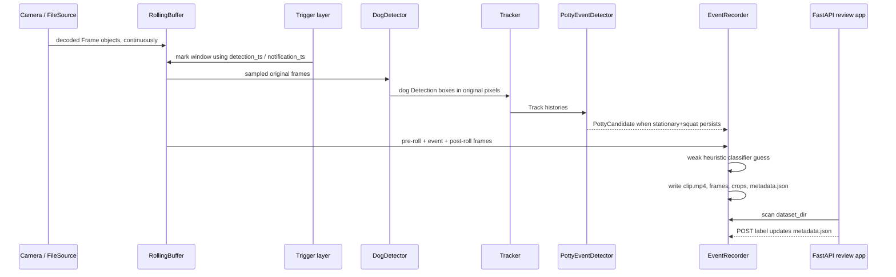

# DetectivePotty Architecture

DetectivePotty is organized around a simple lifecycle: keep camera frames warm, detect dogs, track posture over time, record candidate potty windows, then let a human label the result. The v0 classifier is deliberately weak; the durable output is a labeled dataset for training.

## Event lifecycle



## Components and contracts

| Module | Responsibility | Key contracts |
| --- | --- | --- |
| `geometry.py` | Bounding boxes, coordinate mapping, frame crops. Supports “detect small, crop big”. | `BBox`, `map_bbox_to_original`, `crop_from_frame` |
| `events.py` | Shared JSON-friendly event contracts. | `Detection`, `Track`, `FrameRecord`, `CropRecord`, `EventMetadata`, `TriggerReason`, `Label`, `LabelStatus`, `ClassifierGuess` |
| `config.py` | Pydantic YAML schema and secret-free config hashing. | `Config`, `GlobalSettings`, `ProtectConfig`, `CameraConfig`, `ZoneConfig`, `load_config`, `resolve_secret` |
| `detect/yolo.py` | Ultralytics wrapper that downsizes frames for inference and returns dog boxes in original-resolution pixels. | `DogDetector`, `InferenceInfo` |
| `sources/base.py` | Source abstraction and secret-stripping source IDs. | `Frame`, `VideoSource`, `sanitize_source_id` |
| `sources/file.py` | Offline video decoding with a synthetic wall-clock timeline. | `FileSource` |
| `sources/rtsp.py` | Live RTSP/RTSPS latest-frame reader with reconnect/backoff. | `RTSPSource` |
| `sources/rolling_buffer.py` | Thread-safe pre-roll frame ring and worker that pumps a source into it. | `RollingBuffer`, `BufferedSourceWorker` |
| `protect/client.py` | UniFi Protect wrapper for camera discovery, RTSPS URLs, snapshots, and recording export. | `ProtectClient`, `ProtectCameraInfo`, `ProtectCameraChannel` |
| `protect/trigger.py` | Deduplicated Protect Animal smart-detect WebSocket trigger parsing. | `ProtectAnimalTrigger`, `parse_smartdetect_event` |
| `triggers/yolo.py` | YOLO fallback/corroboration trigger over a warm source. | `YoloTrigger`, `TriggerEvent` |
| `tracking.py` | Lightweight IoU tracker. | `Tracker`, `iou` |
| `potty_event.py` | Trigger-agnostic state machine for generic potty candidates. | `PottyEventDetector`, `PottyCandidate` |
| `classify/heuristic.py` | Weak v0 pee/poop metadata prefill. Always needs human labeling. | `HeuristicPottyClassifier`, `ClassifierResult` |
| `recording/` | Dataset pathing, MP4 writing, image/crop writing, metadata, retention. | `EventRecorder`, `write_event_images`, `enforce_retention` |
| `pipeline.py` | Orchestrates sources, detector, tracker/state machine, classifier, recorder, and retention. | `PottyPipeline`, `run_pipeline` |
| `web/` | Local review/labeling app over the on-disk dataset. | `create_app`, `DatasetIndex` |
| `cli.py` | Typer commands for run, serve, camera listing, and single-file detection. | `detectivepotty` script |

## Lifecycle details

1. **Capture warms up first.** File mode decodes inline. Protect mode obtains an RTSPS URL, starts an `RTSPSource`, and pumps frames into a `RollingBuffer` so event capture is not cold-started.
2. **Triggers annotate windows.** `ProtectAnimalTrigger` parses Animal smart-detect events with detection and notification timestamps. `YoloTrigger` can emit fallback dog-appearance triggers from a warm source. The state machine itself only needs detections and a `TriggerReason`, so it is trigger-agnostic.
3. **Detect small, crop big.** `DogDetector` resizes only the inference frame. Detections are mapped back to original pixel coordinates. `EventRecorder` saves full frames and dog-centered crops from the original decoded frames.
4. **Track posture.** `Tracker` links dog detections by IoU. `PottyEventDetector` watches for a stationary window plus a squat-like bbox height/aspect change. It emits a camera/time-window `PottyCandidate`, not just a raw track ID.
5. **Record after post-roll.** The pipeline waits for `post_roll_s`, assembles `[pre_roll, event, post_roll]` from the buffer/history, runs the weak classifier, and writes `clip.mp4`, `frames/`, `crops/`, and `metadata.json`.
6. **Review is the source of truth.** The FastAPI app scans `metadata.json` files, serves media, and atomically updates `label`, `label_status`, `extra.label_note`, and `extra.labeled_at`.

## Threading model

- **Multi-camera concurrency:** When more than one camera is selected, `PottyPipeline.run` dispatches each camera to a `ThreadPoolExecutor` worker. By default every camera gets a dedicated thread (`max_workers = len(selected)`) so nothing is ever queued; this prevents a live camera's infinite loop from starving the others. Each live (protect) camera always needs a dedicated thread because its loop never returns, so an explicit `--max-workers` below the live-camera count is raised back up (with a warning), and live cameras are submitted first. A single camera is run inline. Per-camera state (detector, classifier, state machine, recorder, rolling buffer, history) is built independently inside each worker, so the only shared state is the read-only config and the factory callables.
- **GPU inference serialization:** A shared `threading.Lock` wraps every `detector.detect(...)` call (file and live loops) because the MPS/torch backend is not reliably safe for concurrent model execution. I/O (RTSP reads, buffering, encoding) still runs in parallel; the lock is uncontended for single-camera runs.
- **Cooperative stop:** A shared `threading.Event` lets live loops exit. `KeyboardInterrupt` is delivered only to the main thread, which sets the event and calls `executor.shutdown(cancel_futures=True)`; worker live loops observe the flag and clean up via their `finally` blocks.
- **Error isolation:** With `continue_on_camera_error=True` (default), one camera's failure is logged and yields `[]` instead of killing the run; results are returned in selected-camera order regardless of completion order.
- **Live buffer memory cap:** Live `RollingBuffer` and frame history are bounded by `max_frames` (derived from `_LIVE_ASSUMED_MAX_FPS`) so N concurrent warm buffers cannot grow unbounded.
- **File cameras:** `process_file_camera` is single-threaded within its worker. Frames are read, retimestamped to the file timeline, appended to the rolling buffer/history, sampled, detected, and recorded in one loop.
- **RTSP cameras:** `RTSPSource.open()` starts a daemon reader thread that continuously decodes and publishes only the latest frame. It reconnects with exponential backoff after stale reads.
- **Buffered live source:** `BufferedSourceWorker.start()` starts a second daemon thread that reads unique latest frames from the source and appends them to `RollingBuffer` for pre-roll queries.
- **Pipeline live loop:** async code samples the latest buffer frame at `sample_rate_fps`, runs detection, records ready candidates, and enforces retention. It runs until interrupted, so the `run_pipeline` return list is only "complete" for finite file/batch cameras.
- **Web app:** FastAPI is stateless over the dataset. `DatasetIndex` rescans `metadata.json` files and uses atomic replace for label writes.

## Data model

`EventMetadata` is intentionally rich and secret-free. It stores UTC timestamps, local offset, camera info, sanitized source ID, Protect metadata when available, trigger latency, model/config/git identity, pre/post-roll settings, detections, tracks, frame records, crop boxes, ambiguity flags, classifier guess, and human label fields.

Dataset paths are generated as:

```text
<dataset_dir>/<camera>/<YYYY-MM-DD>/events/<YYYYMMDDTHHMMSSZ>_<camera>_<track>_<eventId>/
```

All path components are sanitized; source URLs are stripped of credentials and sensitive query parameters before being persisted.

## Design decisions and risks

- **Weak guess, not truth.** `HeuristicPottyClassifier` is only a review prefill. Training labels must come from humans.
- **Latency-safe pre-roll.** Protect smart-detect and RTSP startup can be late; warm buffers plus generous `pre_roll_s`/`post_roll_s` reduce missed lead-up.
- **Detect-small-crop-big.** Whole downscaled frames are bad classifier inputs. Store original-resolution frames, bboxes, and crops so crops can be regenerated later.
- **Dataset bias.** Triggered events alone overrepresent positives. Future capture should include random background clips and near-miss hard negatives.
- **Retention.** `retention_days` and optional `retention_max_gb` bound dataset growth per camera.
- **Secrets.** NVR API keys/user/passwords live in environment variables only. YAML, metadata, source IDs, logs, and dataset paths should stay secret-free.
- **Protect variability.** UniFi OS versions, TLS, API-key availability, RTSP enablement, and Animal smart-detect support vary by deployment.
- **Multiple dogs.** Events are camera/time-window-centric and carry `multi_dog` / `ambiguous` flags because track IDs can swap during overlap.

## Current validation path

The offline tests inject fake detectors and synthetic videos, so they do not require a GPU, model download, NVR, camera, or network. The integration path exercises `run_pipeline` → dataset writer → FastAPI review API → label update on disk.
